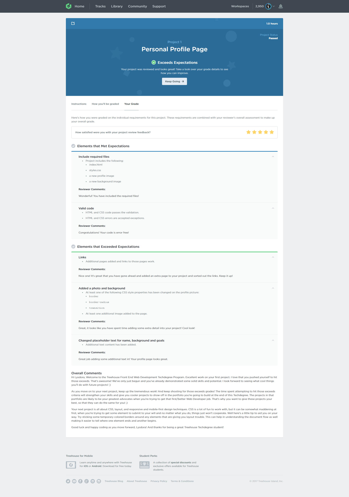
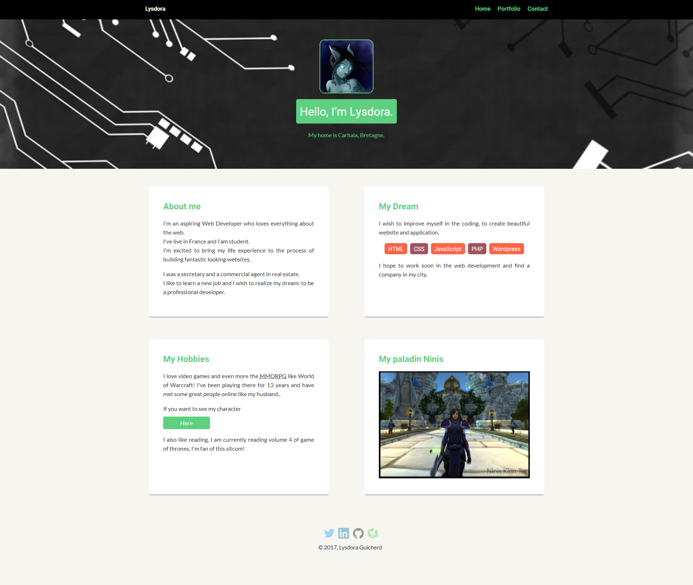

# Personnal Profil Page
## techdegree-project-1

**Project Submit 31/08/2017**

**Passed with exceeds expectations**

-----------------------------------------------------

For your first project, you’ll practice web design skills by customizing a web page to create a personal profile. You'll modify the code for a basic web page by adding graphics, custom text, and a stylish design. This is a great way for you to practice HTML and CSS skills. It also gives you a web page you can use as a personal online calling card to advertise your experience, skills, and goals, and to provide links to your social media accounts on Twitter, LinkedIn and GitHub.

You'll also practice using GitHub, an important tool used by millions of developers to share code and work collaboratively on programming projects. Creating and using a GitHub account is also a great way to share your work with potential employers

**Project instruction**

**Create or find an image file to represent yourself and a new image for the background. Be aware of file size: keep the profile image under 400 KB and the background image under 1 MB (see the link in the project resources section to Picresize, an online image resizing tool).**

-----------------------------------------------------

**Using a text editor, modify the HTML of the index.html file:**
 * Add the images you collected in step 1 to the page. Please leave the class "profile-image" intact on your profile image.
 * Don't forget to update the text for your new profile image's alt attribute!
 
 -----------------------------------------------------
 
 **Personalize all the text on the page by changing the name, background and goals. Feel free to make up the information if you do not wish to share anything personal.**
 
  -----------------------------------------------------
  
  **Add links to your GitHub, Twitter and LinkedIn accounts. If you don't have a Twitter or LinkedIn account, or don't want to share those, then you need to delete those links.**
  
 -----------------------------------------------------
 
 **Edit the navigation link for Home to navigate to the index.html.**
 
  -----------------------------------------------------
  
 **Feel free to expand on this project, by adding an additional page or two, adding more images and customizing the CSS.**
 
   -----------------------------------------------------
   
  **If you do not want to add an additional page then delete the experience link in the HTML.**
  
  -----------------------------------------------------
  
  **Put your project files in a new GitHub repository on your GitHub account:**
   * Make sure that you're only putting the files for this project in that repository.
    * Please do not create any new folders for this project.
   * The GitHub Desktop application can automatically create a new repository for you. See the workshop 'Share Your Techdegree Projects with Github Desktop' for more info on how to put your project onto GitHub using the GitHub Desktop app (linked in the Additional Resources section).

  -----------------------------------------------------
  
 **Make sure to check your code is valid by running it through an HTML and CSS validator.**
  *Links to the validators can be found in the Project Resources. This will help you spot any errors that might be in your code.
   **There are a few exceptions that you don’t need to fix:**
    * Don’t worry about any warnings, we just need you to check any errors that might be there.
    * If CSS validator flags use of calc, vendor prefixes or pseudo-elements/pseudo-classes these errors should be ignored.
    * If HTML validator flags use of pipe (|) in Google font links/URLs this error can also be ignored.
    
   -----------------------------------------------------
   
  ## My Submission ##
  

 
